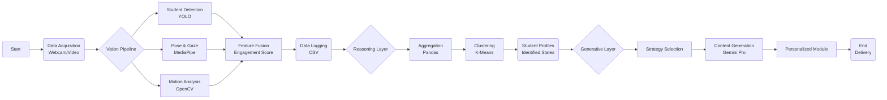

# EMERGENCE: Intelligent Classroom Learning System

## 1. Abstract
The **Intelligent Classroom Learning System (EMERGENCE)** is an integrated AI architecture designed to transform traditional "one-size-fits-all" instruction into adaptive, student-centric education. The system operates in three stages: **Perception**, **Reasoning**, and **Generation**. By observing student engagement through computer vision (student detection, pose estimation, gaze tracking), reasoning over these behavioral signals using unsupervised machine learning (clustering), and generating personalized learning content via Large Language Models (LLMs), EMERGENCE provides a closed-loop solution for real-time educational adaptation. This report details the system's design, implementation methodology, and operational flow.

## 2. Introduction
Traditional classroom environments often struggle to address the diverse learning needs of every student. Teachers, constrained by limited bandwidth and resources, must deliver uniform content that may leave some students bored and others overwhelmed. The lack of real-time, objective feedback on student engagement further exacerbates this issue.

EMERGENCE addresses this gap by proposing a scalable, non-intrusive AI framework. It leverages standard classroom hardware (cameras) to capture behavioral cues—such as gaze direction, posture, and motion energy—to infer engagement levels. This data drives an analytical engine that identifies at-risk or highly engaged students and triggers a generative AI layer to produce tailored educational interventions, such as simplified explanations or advanced challenges, thereby democratizing personalized learning.

## 3. Literature Review
The development of EMERGENCE interacts with three key domains of educational technology research:

*   **Computer Vision in Education**: Previous works have utilized facial expression analysis and eye-tracking to monitor attention. However, many rely on specialized hardware. EMERGENCE builds upon recent advancements in lightweight pose estimation (e.g., MediaPipe) and object detection (YOLO) to perform robust analysis using standard webcams.
*   **Multimodal Learning Analytics (MMLA)**: MMLA suggests that combining multiple signal sources yields better insights than single-modal data. This project implements this by fusing gaze, posture, and motion data into a composite "Engagement Score," a technique supported by research in affective computing.
*   **Generative AI for Personalization**: The rise of LLMs (like GPT-4 and Gemini) has enabled the automated creation of educational content. EMERGENCE allows for dynamic curriculum adaptation, moving beyond static recommendation systems to actual content generation based on learner profiles.

## 4. Problem Statement
In physical classrooms, instructors cannot simultaneously monitor and adapt to the micro-behaviors of every student.
1.  **Latency in Feedback**: Teachers often realize a student is struggling only after exams, weeks later.
2.  **Subjectivity**: Engagement assessment is often biased or based on limited observation.
3.  **Static Curriculum**: Content is fixed, preventing real-time adaptation to the class's current cognitive state.

## 5. Objective
The primary objective is to develop a functioning Minimum Viable Product (MVP) of the EMERGENCE system that can:
1.  **Monitor**: Accurately detect students and quantify their engagement in real-time using computer vision.
2.  **Analyze**: Classify students into distinct engagement profiles (e.g., "Needs Support", "Active", "Highly Engaged") without prior labeling.
3.  **Adapt**: Automatically generate and deliver personalized learning modules and assessments tailored to each student's specific engagement profile.

## 6. Methodology
The system implementation is divided into three distinct layers, corresponding to the `src` directory structure of the codebase.

### 6.1 Phase 1: Vision Layer (Perception)
*Located in `src/vision/`*

The Vision Layer acts as the system's eyes. It processes video input (live webcam or recorded file) to extract raw behavioral data.
*   **Student Detection**: Utilizes **YOLO (You Only Look Once)** via the `StudentDetector` class to identify and track students in the frame, assigning unique IDs.
*   **Pose & Gaze Estimation**: The `PoseExtractor` (likely utilizing **MediaPipe**) analyzes each student's crop to determine head orientation and body posture.
*   **Motion Analysis**: The `MotionAnalyzer` computes optical flow or frame differences to quantify physical activity levels.
*   **Engagement Fusion**: A weighted heuristic combines these signals into a single scalar metric:
    $$ \text{Score} = 0.6 \times \text{Gaze} + 0.25 \times \text{Posture} + 0.15 \times \text{Motion} $$
    *Heuristic adjustments are applied for specific actions like "raising hand" or "sleeping".*
*   **Output**: Time-series log of engagement metrics saved to `data/engagement_log.csv`.

### 6.2 Phase 2: Reasoning Layer (Analysis)
*Located in `src/reasoning/`*

The Reasoning Layer interprets the raw data to form high-level insights.
*   **Data Aggregation**: The `EngagementAnalytics` class loads the raw CSV logs and aggregates metrics by `student_id` to compute average behavior over the session.
*   **Clustering**: It employs **K-Means Clustering** (Unsupervised Learning) to group students based on their engagement and gaze scores.
*   **Profile Mapping**: Clusters are dynamically mapped to semantic labels:
    *   *Cluster 0*: **Needs Support** (Low Engagement) - Requires simplified content.
    *   *Cluster 1*: **Active** (Medium Engagement) - Standard curriculum.
    *   *Cluster 2*: **Highly Engaged** (High Engagement) - Advanced challenges.
*   **Output**: Structured student profiles saved to `data/profiles/student_profiles.csv`.

### 6.3 Phase 3: Generative Layer (Intervention)
*Located in `src/generation/`*

The Generative Layer closes the loop by acting on the insights.
*   **Content Generation**: The `CurriculumGenerator` utilizes **Google's Gemini Pro API**.
*   **Prompt Engineering**: Dynamic prompts are constructed based on the student's profile.
    *   *For "Needs Support"*: Prompts request "simple analogies, breakdown of concepts, encouraging tone."
    *   *For "Highly Engaged"*: Prompts request "deep insights, complex examples, challenge questions."
*   **Assessment**: The `MicroTestGenerator` creates quick checks for understanding relevant to the adaptation strategy.
*   **Output**: Personalized markdown content files rendered for each student.

## 7. Pert Chart
The following Program Evaluation Review Technique (PERT) chart illustrates the data flow and dependencies within the EMERGENCE pipeline.

## 8. Conclusion
The EMERGENCE system demonstrates the feasibility of a fully automated, closed-loop educational intelligence system. By successfully integrating computer vision for non-intrusive monitoring, unsupervised learning for unbiased student profiling, and generative AI for instant curriculum customization, the project lays the groundwork for the next generation of smart classrooms. The current MVP validates the core architecture, proving that real-time behavioral data can effectively drive personalized learning outcomes.

## 9. References
1.  **YOLO (You Only Look Once)**: Redmon, J., et al. "You Only Look Once: Unified, Real-Time Object Detection." *CVPR*, 2016.
2.  **MediaPipe**: Lugaresi, C., et al. "MediaPipe: A Framework for Building Perception Pipelines." *arXiv preprint*, 2019.
3.  **Scikit-learn**: Pedregosa, F., et al. "Scikit-learn: Machine Learning in Python." *JMLR*, 2011.
4.  **Google Gemini**: Google DeepMind. "Gemini: A Family of Highly Capable Multimodal Models." 2023.
5.  **OpenCV**: Bradski, G. "The OpenCV Library." *Dr. Dobb's Journal of Software Tools*, 2000.
